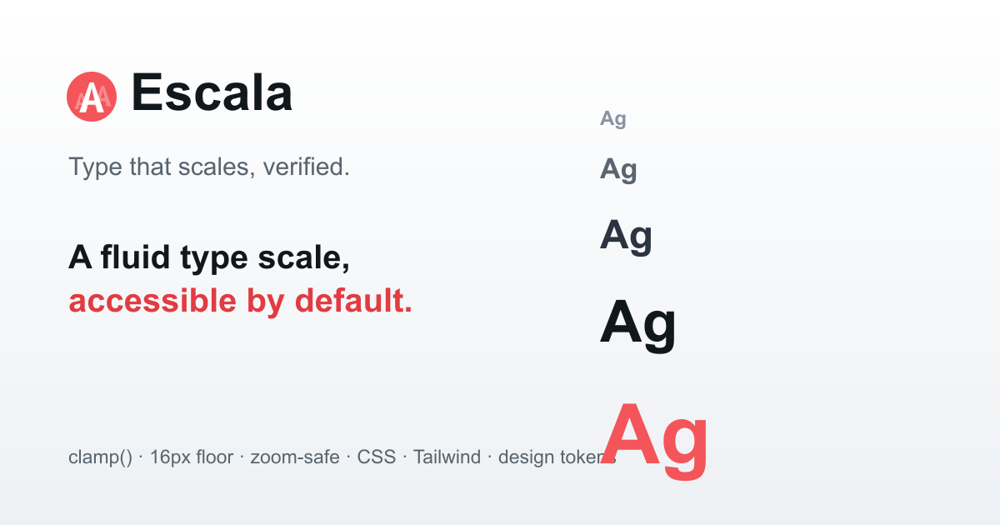

# Escala

**Type that scales, verified.** A fluid type-scale generator for design systems: build a modular scale, watch it interpolate fluidly across the viewport with `clamp()`, and get accessibility guardrails — a 16px body floor, zoom-safe sizing, line-height pairing, and an optimal measure — checked as you go. Export to CSS, Tailwind, or design tokens.

🔗 **Live:** https://get-escala.vercel.app · Built by [Kevin Heineman](https://www.kevinheineman.com/)



---

## Why

Most type-scale tools stop at "pick a ratio, get some sizes." But a scale that's right on a 1440px display is often too big on a phone, and the modern answer — fluid `clamp()` sizing — has a sharp edge: a size expressed purely in `vw` silently breaks browser zoom and fails [WCAG 1.4.4](https://www.w3.org/WAI/WCAG21/Understanding/resize-text.html). Escala generates the fluid scale _and_ holds it to the accessibility rules most generators ignore, then hands you tokens you can paste straight into a codebase.

## Features

- **Fluid by construction** — set a narrow-viewport context (base + ratio) and a wide-viewport context; every step interpolates between them as `clamp(min, rem + vw, max)`, the [Utopia](https://utopia.fyi/) method.
- **Live specimen** — real headings and body copy rendered at every step, with a **preview-width slider** so you watch the scale interpolate without resizing the window.
- **Accessibility checks** — surfaced as you edit, never by color alone:
  - **Body ≥ 16px** on small screens, so mobile reading stays comfortable.
  - **Zoom- and resize-safe** — every `clamp()` keeps a `rem` lower bound and a `rem` term in its preferred value, so text still grows with zoom and the user's default font size ([WCAG 1.4.4](https://www.w3.org/WAI/WCAG21/Understanding/resize-text.html)).
  - **Body line-height reaches 1.5** ([WCAG 1.4.12](https://www.w3.org/WAI/WCAG21/Understanding/text-spacing.html)).
  - **Legibility floor** — warns when the smallest step drops under ~12px.
  - **Optimal measure** — exports a `--measure` of 66ch for the 45–75 characters-per-line reading range.
- **Line-height pairing** — a sensible unitless line-height per step (tight for display, generous for body) computed and exported alongside the sizes.
- **Export** — CSS custom properties, a Tailwind `fontSize` config (with `lineHeight` tuples), [W3C design tokens](https://www.designtokens.org/), or a machine-readable JSON spec you can diff in CI.
- **Shareable** — the whole scale lives in the URL, so any scale is a link.
- **Accessible by construction** — held to WCAG AA in light and dark themes, with visible focus, status conveyed by icon + text, and `prefers-reduced-motion` respected.

## How the scale is computed

Each step is a modular size, `base × ratio^step`, evaluated at both the narrow and wide contexts. The two endpoints `(minVw, sizeMin)` and `(maxVw, sizeMax)` define a line; Escala emits it as:

```
clamp(sizeMinRem, interceptRem + slopeVw, sizeMaxRem)
```

where `slopeVw = slope × 100` and `interceptRem` is the line's y-intercept in rem (root assumed 16px). Because both bounds and the preferred value carry a `rem` term, the result honors browser zoom and the user's font-size preference — the property a pure-`vw` size loses.

Line-height is unitless so it holds across the fluid range: body and smaller stay at 1.5, larger sizes tighten toward 1.1. The "measure" follows the classic 45–75 characters-per-line guidance (~66ch ideal).

All of it is hand-written with **zero runtime dependencies** and covered by unit tests (step math, `clamp()` generation, zoom-safety, exporter output, URL round-trips).

## Tech

React 18 · Vite · Vitest · plain CSS with custom-property theming. No UI framework. Shares [Contraste](https://get-contraste.vercel.app/)'s design language so the two read as a set.

## Getting started

```bash
npm install
npm run dev        # start the dev server
npm test           # run the scale/typography/exporter unit tests
npm run build      # production build to dist/
```

### Regenerating icons & social image

Favicon and OG assets are generated from [`public/favicon.svg`](public/favicon.svg) so nothing binary needs hand-editing. `sharp` is installed transiently to keep it out of the dependency tree:

```bash
npm install --no-save sharp
node scripts/generate-assets.mjs
```

## Project structure

```
src/
  lib/                 # framework-free core (unit-tested)
    scale.js           # modular scale + fluid clamp() generation
    typography.js      # line-height pairing, measure, accessibility checks
    exporters.js       # CSS / Tailwind / design tokens / JSON spec
    url.js             # shareable scale state
    presets.js         # ratios, defaults, sample scales, specimen copy
  components/          # presentational React components
  App.jsx              # state + composition
```

## License

[MIT](LICENSE) © Kevin Heineman
